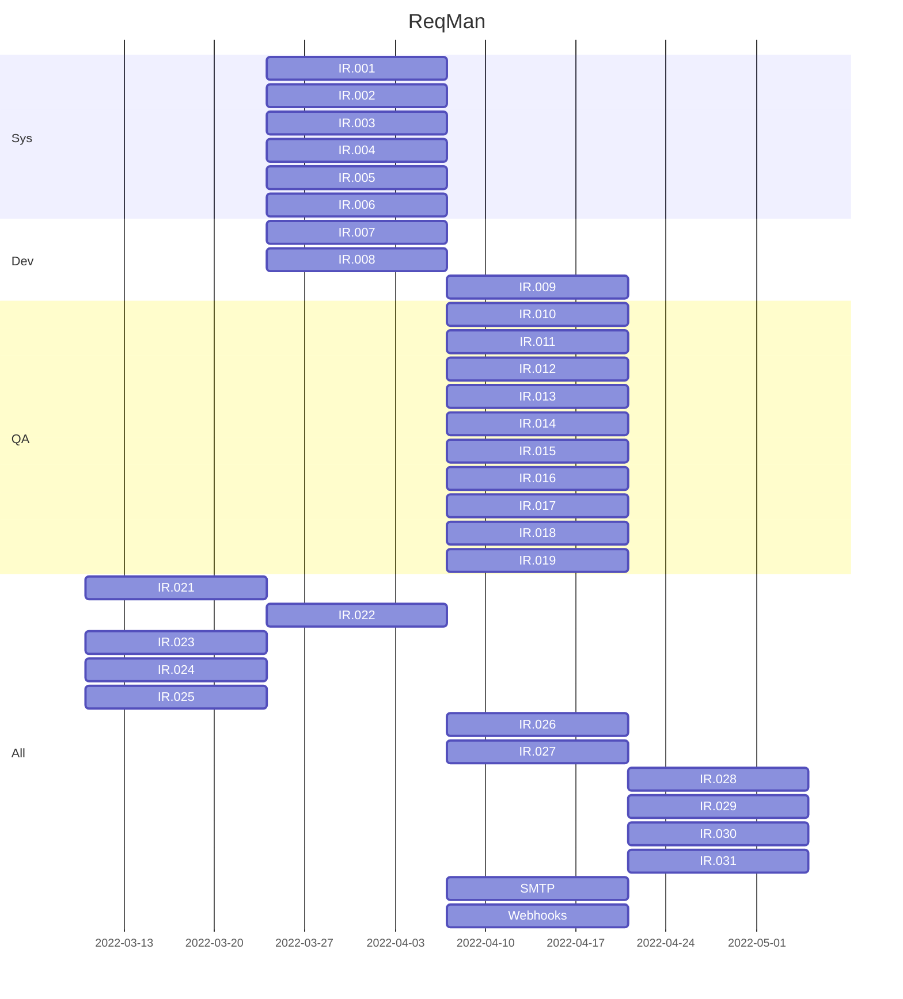

# ReqMan 项目概述

## 项目背景

大规模复杂软件的开发往往需要很多不同分工的软件研发人员进行协同。对于一个大型工程来说，需求的管理与跟踪也是基本工作流程的支撑。但是对于不同类型的公司，软件开发的流程、软件系统架构等都会又较大区别，自研的工作流程支撑产品也因此备受青睐。

在此背景下，**ReqMan 需求管理系统**应势而生。我们制作的软件研发 IT 支撑系统精简而易于上手，能够高质量完成需求管理、缺陷跟踪等全研发过程管理，帮助用户在更加优雅而高效进行项目开发。

## 项目目标

本项目主要目标为通过参考华为内部的研发过程，进⾏高度简化，实现⼀个⾮常精简的软件研发的 IT ⽀撑系统，完成基本的需求管理和缺陷跟踪功能、回溯，对研发过程进行管理。 

从用户视角分析，本项目需要让系统工程师、开发工程师以及质量保证工程师等不同角色实现各自的基本工作流程，这包括而不限于原始以及功能需求定义、分解与关联，迭代的划分与开发，项目质量跟踪与评估等等。

除此之外，本管理系统的第一个客户也将是我们自己的开发项目，即本系统应能够实现对自身项目的管理、缺陷跟踪以及迭代开发。

## 需求分析

### 用户故事

**系统工程师 小A**：我是一名系统工程师。在每一个项目中，我不仅负责和客户交流需求，也需要设计总体的架构方案。

甲方多样化的需求每次都让我眼花缭乱，我希望我工作的平台能够随时根据用户意见反馈添加、修改或删除原始需求以及功能需求；同时我还希望能够定义不同的软件系统服务以及开发迭代等等，让整个项目管理过程更加自由而流畅。

很多功能需求在实际开发中都可能被复用，处理好服务以及各种需求的关系是我这么多年来摸索出的项目管理之关键，因此我希望能够更加灵活的关联功能与功能、功能与服务之间的联系，让项目逻辑结构更加清晰。

在项目成员上，我也希望能够实现更加自由的管理，随时欢迎成员加入团队、指定负责人等等，让团队协作更加高效。

**开发工程师 小B**：我是一名开发工程师。在每一个项目中，我负责根据系统工程师的设计实现软件开发与运行环境搭建，实现需求和功能的开发和迭代。

我最烦的事情就是需求说不清楚就开始被拉着干活，之后还要推翻重改。因此对我来说，我非常希望平台能够让我随时随地查看需求、迭代以及我要负责哪些部分，这才能让我都开发思路更加清晰。

每个需求写完了，必须得及时通知到老板，可别让 ta 天天 push 我。因而平台当然需要支持我能够修改需求状态等等，让项目的合作更加便捷高效。

众所周知，程序员最大的特点就是“懒惰”，我也不例外，真希望平台能够和我的 GitLab 账号等开发仓库也能够进行关联，每次 Commit 代码，每次 Merge 都能自动记录，帮我自动化修改各个需求状态。这样的平台才是程序员的梦想，开发代码写着一定会更有动力！

**质量保证工程师 小C**：我是一名质量保证工程师，在每一个项目中，我负责跟踪项目的进展与质量，及时发现问题与风险。

我的主要工作就是对整个项目进行“督查”，因此及时查看各个迭代、需求状态与计划的偏差是我工作的必要。除此之外，我还希望能够能够定时获取 MR 的信息。

对于 MR 与功能需求、缺陷之间的关联，我也希望能够及时获取，并进行自动化呈现，这样会免去很多不必要的人工工作，让问题的发现与解决更加高效。

除此之外，我发现 Git 上并没有对很多 issue 信息，MR 信息进行很好的可视化呈现，这就让我的宏观数据分析变得异常繁琐。因此我还希望平台能够提供可视化的 issue 交付质量，MR 及代码行数等相关自动化统计结果，以便于对工程师进行评价（快速抓住谁在摸鱼哦）。

### 用户用例图

{.img-fluid tag=1}

系统工程师用例图

{.img-fluid tag=1}

开发工程师用例图

{.img-fluid tag=1}

质量保证工程师用例图

*注：在以上三个图例中，橙色均代表该用户可以修改，而绿色代表仅支持查看。

### 泳道图流程展示

{.img-fluid tag=1}

流程泳道图

## 需求清单

### 需求表

| 需求编号*      | 需求描述                                                     | 交付时间 |
| -------------- | ------------------------------------------------------------ | -------- |
| &lt;IR.001&gt; | 系统工程师 支持 录⼊原始需求                                 | Sprint 2 |
| &lt;IR.002&gt; | 系统工程师 支持 定义软件系统服务                             | Sprint 2 |
| &lt;IR.003&gt; | 系统工程师 支持 分解原始需求到功能需求                       | Sprint 2 |
| &lt;IR.004&gt; | 系统工程师 支持 关联功能需求到各服务                         | Sprint 2 |
| &lt;IR.005&gt; | 系统工程师 支持 划分功能需求到不同开发迭代                   | Sprint 2 |
| &lt;IR.006&gt; | 系统工程师 支持 指定迭代开发责任⼈                           | Sprint 2 |
| &lt;IR.007&gt; | 开发工程师 支持 查看所有需求、负责的迭代、迭代关联的需求     | Sprint 2 |
| &lt;IR.008&gt; | 开发工程师 支持 根据交付情况修改功能需求状态：初始、开发中、已交付 | Sprint 2 |
| [IR.009]       | 开发工程师 支持 基于 commit 修改功能需求状态                 | Sprint 3 |
| &lt;IR.010&gt; | 质量保证工程师 支持 查看迭代状态、需求状态、需求交付与迭代计划的偏差 | Sprint 3 |
| &lt;IR.011&gt; | 质量保证工程师 支持 查看定时获取的 Merge Request 信息        | Sprint 3 |
| &lt;IR.012&gt; | 质量保证工程师 支持 将 MR 与功能需求关联                     | Sprint 3 |
| [IR.013]       | 质量保证工程师 支持 查看 自动完成的 MR 与功能需求的关联      | Sprint 3 |
| &lt;IR.014&gt; | 质量保证工程师 支持 查看 功能需求在哪些 MR 交付              | Sprint 3 |
| &lt;IR.015&gt; | 质量保证工程师 支持 查看 需求交付后的缺陷 （issue） 统计     | Sprint 3 |
| &lt;IR.016&gt; | 质量保证工程师 支持 查看 缺陷在哪些 MR 修复                  | Sprint 3 |
| [IR.017]       | 质量保证工程师 支持 查看 基于 issue 的需求交付质量分析       | Sprint 3 |
| [IR.018]       | 质量保证工程师 支持 查看基于 MR 数量、代码行数的开发工程师活跃度 | Sprint 3 |
| [IR.019]       | 质量保证工程师 支持 查看基于 issue 解决时间的开发工程师能力评价 | Sprint 3 |
| [IR.020]       | 质量保证工程师 支持 查看代码自动分析结果（代码片段对应的功能需求） | 未开始   |
| &lt;IR.021&gt; | 所有用户 支持 注册，注册信息包含用户名，密码，角色           | Sprint 1 |
| &lt;IR.022&gt; | 所有用户 支持 修改密码、经负责人同意后修改角色               | Sprint 2 |
| &lt;IR.023&gt; | 所有用户 认证后才可操作                                      | Sprint 1 |
| &lt;IR.024&gt; | 安全性 用户和系统访问使用安全加密通道                        | Sprint 1 |
| &lt;IR.025&gt; | 安全性 不使用明⽂存储用户密码，不需要还原口令时必须不可逆加密 | Sprint 1 |
| &lt;IR.026&gt; | 系统规格 1. 支持100个用户同时在线 2. 支持至少1k原始需求、10k功能需求 | Sprint 3 |
| &lt;IR.027&gt; | 系统设计 一个功能需求只由一个系统服务实现                    | Sprint 3 |
| [IR.028]       | 其它 支持 角色更改导致的需求回退                             | Sprint 4 |
| [IR.029]       | 其它 支持 开发过程需求更改                                   | Sprint 4 |
| [IR.030]       | 其它 支持 开发过程需求更改                                   | Sprint 4 |
| [IR.031]       | 使用自己的项目管理项目开发过程                               | 管理中   |

*注：`<·>` 表示必做，`[·]` 表示选做

## 用户权限

一个“项目”中用户有**项目管理员、系统工程师、开发工程师、质保工程师、项目成员**五种身份。这五种身份的权限表列举如下。

|                                 | 项目管理员 | 系统工程师 | 开发工程师 | 质保工程师 | 项目成员 |
| ------------------------------- | ---------- | ---------- | ---------- | ---------- | -------- |
| 查看 当前项目成员               | O          | O          | O          | O          | O        |
| 查看 当前项目原始需求           | O          | O          | O          | O          | O        |
| 修改 当前项目原始需求           | O          | O          | X          | X          | X        |
| 查看 当前项目功能需求           | O          | O          | O          | O          | O        |
| 修改 当前项目功能需求           | O          | O          | X          | O          | X        |
| 修改 当前项目功能需求状态       | O          | O          | O          | O          | X        |
| 查看 原始需求和功能需求关联     | O          | O          | O          | O          | O        |
| 修改 原始需求和功能需求关联     | O          | O          | X          | X          | X        |
| 查看 当前功能需求与迭代关联     | O          | O          | O          | O          | O        |
| 修改 当前功能需求与迭代关联     | O          | O          | X          | X          | X        |
| 查看 当前项目迭代周期           | O          | O          | O          | O          | O        |
| 修改 当前项目迭代周期           | O          | O          | X          | X          | X        |
| 查看 当前迭代负责人             | O          | O          | O          | O          | O        |
| 修改 当前迭代负责人             | O          | O          | X          | X          | X        |
| 查看 当前项目服务               | O          | O          | O          | O          | O        |
| 修改 当前项目服务               | O          | O          | X          | X          | X        |
| 修改 服务关联的功能需求         | O          | O          | X          | X          | X        |
| 查看 当前项目功能需求的修改记录 | O          | O          | O          | O          | O        |
| 查看 MR                         | O          | O          | O          | O          | O        |
| 查看 MR 和功能需求关联          | O          | O          | O          | O          | O        |
| 修改 MR 和功能需求关联          | O          | X          | X          | O          | X        |
| 查看 Issue                      | O          | O          | O          | O          | O        |
| 查看 Issue 和 MR 的关联         | O          | O          | O          | O          | O        |
| 修改 Issue 和 MR 的关联         | O          | X          | X          | O          | X        |
| 查看 Repo                       | O          | O          | O          | O          | O        |
| 修改 Repo                       | O          | X          | X          | X          | X        |
| 查看 Issue                      | O          | O          | O          | O          | O        |

补充说明：

+ 创建项目的用户自动成为该项目的“项目管理员”

## 开发甘特图

